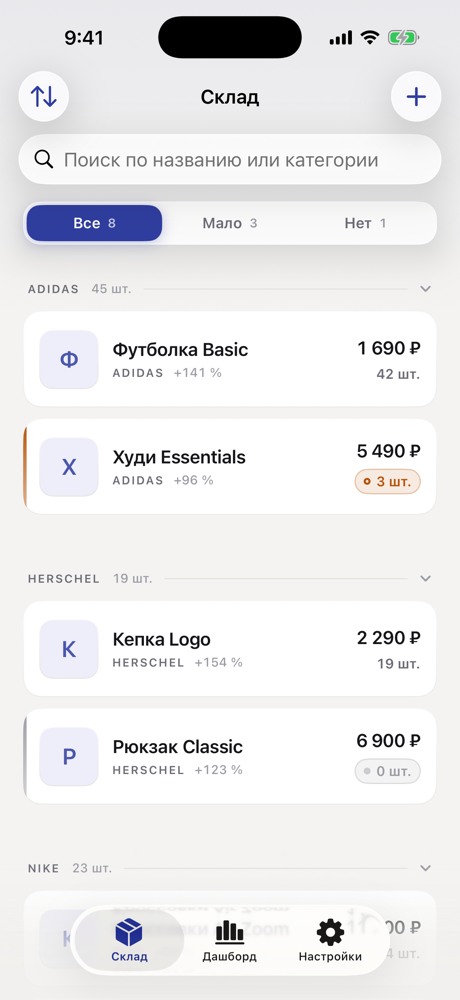
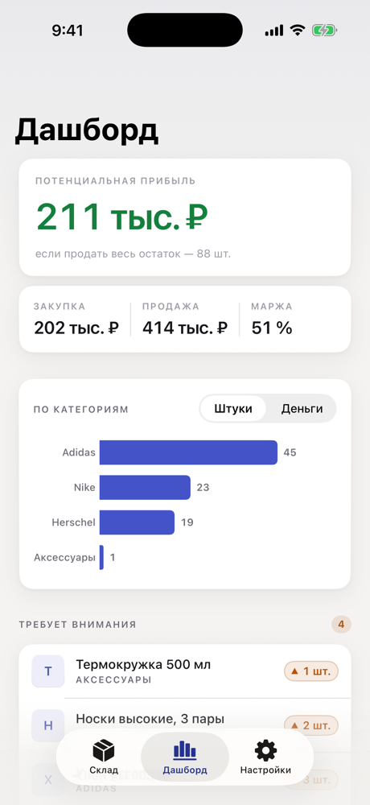
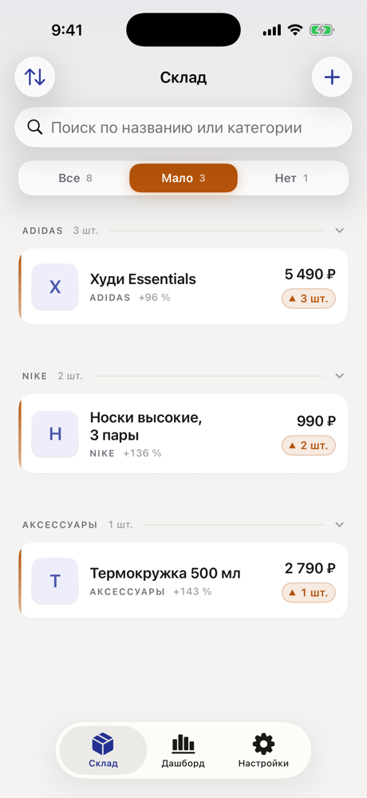
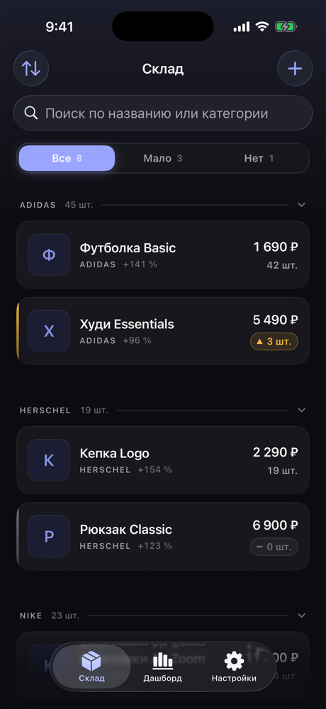
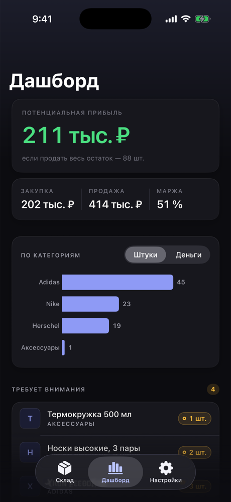

# Как выглядит приложение

Снимки делаются автоматически на каждой сборке: workflow поднимает симулятор
iPhone, наполняет базу демо-товарами и обходит экраны через deep links.
Обновляются сами, руками ничего делать не нужно.

## Склад

Карточки товаров, фильтр со счётчиками, сворачиваемые секции по категориям.

## Дашборд

Суммы закупки и продажи, потенциальная прибыль, маржа и остатки по категориям.

## Настройки

Статус iCloud, порог «мало на складе», валюта, экспорт CSV и выбор темы.

## Фильтр «Мало»

То, что открывается тапом по виджету.

## Тёмная тема

